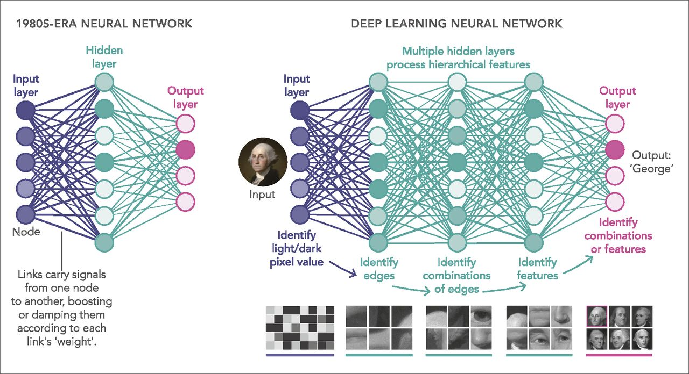
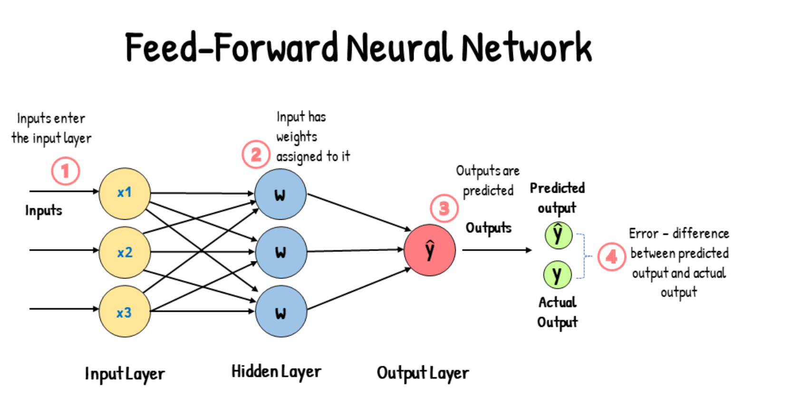
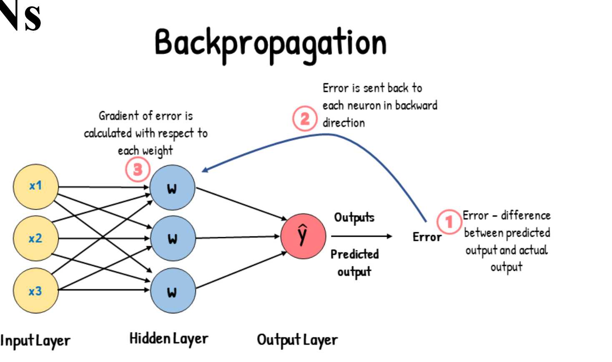

# Computer Vision - 14 July 2024 - Week 10
## Introduction to DNNs 

**What is DNNs?**
- Deep Neural Networks
(DNNs) are a class of
artificial neural
networks with multiple
layers between the input
and output layers

**Example: Building a Simple Neural Network**

- **Basic components**
  - **Neurons**: The basic units of a neural network,
inspired by biological neurons
  - **Weights**: Parameters that determine the influence of
each input on the neuron's output
  - **Biases**: Additional parameters that adjust the output
along with the weighted sum of the inputs.
  - **Activation Function**: A Function apply to the neurons
- **Layers in Neural Networks**
  - Input layer
  - Hidden Layer
  - Output layer
- **Key Processes**
  - **Feedforward**: The process where input data passes through the network layers
to generate an output.
  
  - **Backpropagation**: The training process that involves adjusting the weights and
  biases to minimize the error between the predicted output and the actual output
  - 
  - **Common Activation Functions**
    
    
